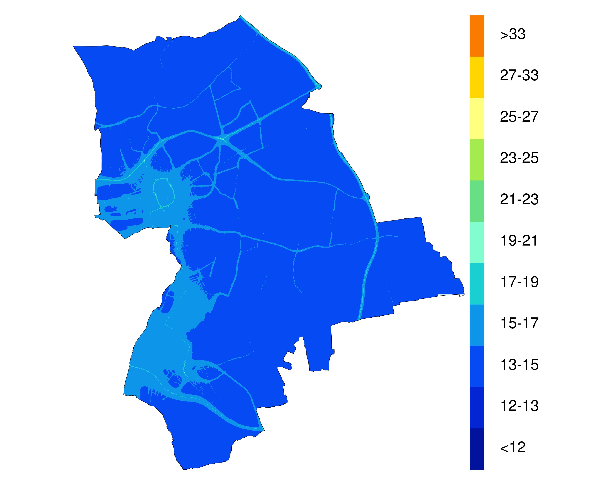

## Colour schemes for plotting air quality data

The following colour schemes create breaks and colours within R that can be used within various other packages to plot raster files of air quality. [For example from the LAEI](https://data.london.gov.uk/dataset/london-atmospheric-emissions-inventory-2013)

## LAEI 2013 Colours
* [NO2](https://github.com/KCL-ERG/colour_schemes/blob/master/no2_laei2013_colours_breaks.R)
* [PM10](https://github.com/KCL-ERG/colour_schemes/blob/master/pm10_laei2013_colours_breaks.R)
* [PM10 days](https://github.com/KCL-ERG/colour_schemes/blob/master/pm10d_laei2013_breaks_colours.R)
* [PM2.5](https://github.com/KCL-ERG/colour_schemes/blob/master/pm25_laei2013_colours_breaks.R)

## Example usage
```r
pm25       <- raster('pm25.asc')

eval(parse(text = getURL('pm25_laei2013_colours_breaks.R')))

levelplot(pm25,
          maxpixels = pm25@ncols/2 * pm25@nrows/2,
          margin = FALSE,
          colorkey = list(
            at = seq(min(pm25_laei2013_breaks), max(pm25_laei2013_breaks), length = 12),
            space = 'right',
            labels = list(at=seq(min(pm25_laei2013_breaks), max(pm25_laei2013_breaks), length = 12), 
                          labels = paste(" \n \n ",pm25_laei2013_labels), 
                          font = 1,
                          cex = 1.5)
          ),
          par.settings = list(
            axis.line =list( col = 'transparent')
          ),
          scales = list(draw = FALSE),
          col.regions = pm25_laei2013_colours,
          at = pm25_laei2013_breaks)
 ```
## Example output


